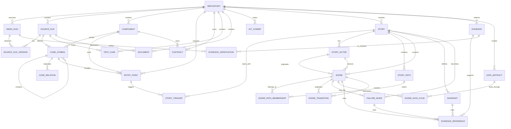

# Modelo de Domínio — Entidades e Relacionamentos

## 1. Visão geral

O StoryCode modela um repositório de software como um grafo de conhecimento verificável.

O grafo conecta dois mundos:

1. **Mundo técnico:** arquivos, símbolos, dependências, testes, contratos, commits e traces.
2. **Mundo narrativo:** histórias, cenas, atores, decisões, invariantes, caminhos e resultados.

A história não substitui o código como fonte de verdade. Ela organiza evidências técnicas em uma narrativa compreensível e navegável.

```text
Repository
  ├── SourceFile
  │     ├── CodeSymbol
  │     ├── ImportRelation
  │     ├── CodeRelation
  │     └── Evidence
  ├── EntryPoint
  ├── Contract
  ├── TestCase
  ├── Document
  ├── GitCommit
  ├── Story
  │     ├── StoryActor
  │     ├── StoryPath
  │     ├── Scene
  │     ├── Invariant
  │     └── EvidenceReference
  └── IndexRun
```

---

## 2. Convenções de modelagem

### 2.1 Identificadores

Toda entidade persistida deve possuir:

- `id`: UUID ou ULID gerado pelo StoryCode.
- `repository_id`: referência ao repositório proprietário, quando aplicável.
- `created_at`: data e hora de criação.
- `updated_at`: data e hora da última atualização.

Entidades extraídas do código também devem possuir uma chave natural ou semântica, usada para reconciliar mudanças entre indexações.

Exemplos:

```text
Arquivo:
  src/services/retrieval.py

Símbolo:
  src/services/retrieval.py::RetrievalService.retrieve

Ponto de entrada:
  http:POST:/v1/chat

História:
  answer-with-rag
```

### 2.2 Estados de confiança

Relações e evidências devem indicar de onde vieram e quão confiáveis são.

```text
SourceType:
  static_analysis
  user_declared
  imported
  git_history
  runtime_trace
  ai_suggested

ConfidenceLevel:
  confirmed
  high
  medium
  low
  unknown
```

Uma relação extraída deterministicamente de AST pode receber `confirmed` ou `high`.

Uma relação sugerida por IA deve receber no máximo `low` até revisão humana.

### 2.3 Soft delete

Entidades indexadas que desapareçam do repositório não devem ser removidas imediatamente.

Elas devem possuir:

```text
deleted_at
last_seen_index_run_id
lifecycle_status:
  active
  missing
  archived
```

Isso permite explicar histórias antigas, mostrar drift e preservar referências históricas.

---

## 3. Entidades principais

## 3.1 Repository

Representa um repositório local analisado pelo StoryCode.

| Campo | Tipo | Obrigatório | Descrição |
|---|---|---:|---|
| `id` | ULID | Sim | Identificador interno |
| `name` | string | Sim | Nome exibido do projeto |
| `root_path` | string | Sim | Caminho absoluto local |
| `remote_url` | string | Não | URL remota sanitizada, se disponível |
| `default_branch` | string | Não | Branch padrão detectada ou configurada |
| `head_commit_sha` | string | Não | Commit Git indexado |
| `config_version` | integer | Sim | Versão da configuração |
| `status` | enum | Sim | Estado geral do repositório |
| `created_at` | datetime | Sim | Data de cadastro |
| `updated_at` | datetime | Sim | Última atualização |

Estados possíveis:

```text
RepositoryStatus:
  initialized
  indexing
  ready
  partially_indexed
  failed
  stale
```

Relacionamentos:

```text
Repository 1 ─── N SourceFile
Repository 1 ─── N Story
Repository 1 ─── N IndexRun
Repository 1 ─── N EntryPoint
Repository 1 ─── N Contract
Repository 1 ─── N Document
Repository 1 ─── N GitCommit
Repository 1 ─── N Component
```

---

## 3.2 IndexRun

Representa uma execução de indexação ou reindexação.

| Campo | Tipo | Obrigatório | Descrição |
|---|---|---:|---|
| `id` | ULID | Sim | Identificador da execução |
| `repository_id` | ULID | Sim | Repositório analisado |
| `kind` | enum | Sim | Tipo de indexação |
| `status` | enum | Sim | Resultado da execução |
| `started_at` | datetime | Sim | Início |
| `finished_at` | datetime | Não | Fim |
| `head_commit_sha` | string | Não | Commit na execução |
| `files_scanned` | integer | Sim | Arquivos encontrados |
| `files_indexed` | integer | Sim | Arquivos indexados |
| `files_failed` | integer | Sim | Arquivos com falha |
| `symbols_found` | integer | Sim | Símbolos extraídos |
| `relations_found` | integer | Sim | Relações extraídas |
| `warnings` | json | Não | Avisos estruturados |
| `error_message` | string | Não | Erro terminal |

Tipos:

```text
IndexRunKind:
  full
  incremental
  verify
  import
  migration
```

Estados:

```text
IndexRunStatus:
  queued
  running
  completed
  completed_with_warnings
  cancelled
  failed
```

Relacionamentos:

```text
Repository 1 ─── N IndexRun
IndexRun 1 ─── N IndexIssue
IndexRun 1 ─── N SourceFileVersion
```

---

## 3.3 SourceFile

Representa um arquivo físico do repositório.

| Campo | Tipo | Obrigatório | Descrição |
|---|---|---:|---|
| `id` | ULID | Sim | Identificador interno |
| `repository_id` | ULID | Sim | Repositório proprietário |
| `path` | string | Sim | Caminho relativo normalizado |
| `language` | string | Não | Linguagem detectada |
| `kind` | enum | Sim | Tipo do arquivo |
| `content_hash` | string | Sim | Hash do conteúdo indexado |
| `size_bytes` | integer | Sim | Tamanho do arquivo |
| `line_count` | integer | Não | Quantidade de linhas |
| `is_generated` | boolean | Sim | Arquivo gerado |
| `is_test_file` | boolean | Sim | Arquivo de teste |
| `is_ignored` | boolean | Sim | Arquivo ignorado |
| `last_seen_index_run_id` | ULID | Sim | Última indexação em que apareceu |
| `deleted_at` | datetime | Não | Momento em que deixou de existir |

Tipos possíveis:

```text
SourceFileKind:
  source_code
  test
  documentation
  configuration
  contract
  migration
  infrastructure
  build
  unknown
```

Restrições:

- `repository_id + path` deve ser único para arquivos ativos.
- `path` deve usar separador `/` internamente, inclusive no Windows.
- Arquivos ignorados podem existir como metadado, mas não devem gerar símbolos ou relações por padrão.

Relacionamentos:

```text
Repository 1 ─── N SourceFile
SourceFile 1 ─── N CodeSymbol
SourceFile 1 ─── N FileRelation
SourceFile 1 ─── N FileVersion
SourceFile 1 ─── N Evidence
SourceFile N ─── N GitCommit
```

---

## 3.4 SourceFileVersion

Representa uma versão observada de um arquivo durante uma indexação.

Essa entidade é necessária para detectar drift sem duplicar toda a estrutura de domínio.

| Campo | Tipo | Obrigatório | Descrição |
|---|---|---:|---|
| `id` | ULID | Sim | Identificador |
| `source_file_id` | ULID | Sim | Arquivo associado |
| `index_run_id` | ULID | Sim | Execução que registrou a versão |
| `content_hash` | string | Sim | Hash do conteúdo |
| `git_blob_sha` | string | Não | Hash do blob Git |
| `line_count` | integer | Não | Linhas observadas |
| `status` | enum | Sim | Estado da observação |
| `observed_at` | datetime | Sim | Momento da observação |

Estados:

```text
SourceFileVersionStatus:
  present
  changed
  missing
  unreadable
  parse_error
```

Relacionamentos:

```text
SourceFile 1 ─── N SourceFileVersion
IndexRun 1 ─── N SourceFileVersion
```

---

## 3.5 Component

Representa um agrupamento lógico ou arquitetural de elementos técnicos.

Exemplos:

```text
Chat API
Authentication Module
Retrieval Service
Qdrant Adapter
Billing Bounded Context
PostgreSQL Persistence
```

Um componente pode ser detectado automaticamente ou declarado por pessoa usuária.

| Campo | Tipo | Obrigatório | Descrição |
|---|---|---:|---|
| `id` | ULID | Sim | Identificador |
| `repository_id` | ULID | Sim | Repositório |
| `name` | string | Sim | Nome exibido |
| `key` | string | Sim | Chave estável |
| `kind` | enum | Sim | Tipo do componente |
| `description` | string | Não | Descrição humana |
| `source_type` | enum | Sim | Origem da informação |
| `confidence` | enum | Sim | Nível de confiança |
| `status` | enum | Sim | Estado atual |

Tipos:

```text
ComponentKind:
  system
  application
  service
  module
  package
  library
  adapter
  database
  queue
  external_api
  worker
  cli
  frontend
  infrastructure
  unknown
```

Relacionamentos:

```text
Repository 1 ─── N Component
Component N ─── N SourceFile
Component N ─── N CodeSymbol
Component N ─── N Component
Component N ─── N Story
Component N ─── N Contract
```

Relacionamentos entre componentes devem usar `ComponentRelation`.

---

## 3.6 CodeSymbol

Representa uma unidade semântica do código.

| Campo | Tipo | Obrigatório | Descrição |
|---|---|---:|---|
| `id` | ULID | Sim | Identificador interno |
| `repository_id` | ULID | Sim | Repositório |
| `source_file_id` | ULID | Sim | Arquivo de origem |
| `parent_symbol_id` | ULID | Não | Símbolo pai |
| `component_id` | ULID | Não | Componente associado |
| `qualified_name` | string | Sim | Nome totalmente qualificado |
| `display_name` | string | Sim | Nome de exibição |
| `kind` | enum | Sim | Tipo de símbolo |
| `visibility` | enum | Não | Visibilidade, quando detectável |
| `signature` | string | Não | Assinatura textual |
| `start_line` | integer | Sim | Linha inicial |
| `start_column` | integer | Não | Coluna inicial |
| `end_line` | integer | Sim | Linha final |
| `end_column` | integer | Não | Coluna final |
| `semantic_hash` | string | Sim | Hash da estrutura relevante |
| `source_type` | enum | Sim | Origem da descoberta |
| `confidence` | enum | Sim | Confiança |
| `last_seen_index_run_id` | ULID | Sim | Última indexação válida |
| `deleted_at` | datetime | Não | Remoção detectada |

Tipos:

```text
CodeSymbolKind:
  module
  package
  class
  interface
  enum
  function
  method
  constructor
  decorator
  route_handler
  cli_command
  event_consumer
  event_producer
  scheduled_job
  task
  variable
  constant
  unknown
```

Restrições:

- `source_file_id + qualified_name + start_line` deve ser único para símbolos ativos.
- `end_line` deve ser maior ou igual a `start_line`.
- Um símbolo pai deve pertencer ao mesmo arquivo ou a uma estrutura semanticamente compatível.
- Um `route_handler` deve poder estar associado a no máximo um `EntryPoint` principal, mas um `EntryPoint` pode apontar para um símbolo handler.

Relacionamentos:

```text
SourceFile 1 ─── N CodeSymbol
CodeSymbol 0 ─── N CodeSymbol
CodeSymbol N ─── 1 Component
CodeSymbol N ─── N CodeSymbol, via CodeRelation
CodeSymbol N ─── N EntryPoint
CodeSymbol N ─── N TestCase
CodeSymbol N ─── N Evidence
CodeSymbol N ─── N Scene
```

---

## 3.7 CodeRelation

Representa uma relação entre dois símbolos ou entre um símbolo e outro recurso técnico.

| Campo | Tipo | Obrigatório | Descrição |
|---|---|---:|---|
| `id` | ULID | Sim | Identificador |
| `repository_id` | ULID | Sim | Repositório |
| `from_symbol_id` | ULID | Sim | Origem |
| `to_symbol_id` | ULID | Não | Destino, quando símbolo conhecido |
| `to_external_ref` | string | Não | Destino externo ou não resolvido |
| `kind` | enum | Sim | Tipo de relação |
| `source_file_id` | ULID | Não | Arquivo onde foi encontrada |
| `line` | integer | Não | Linha da relação |
| `metadata` | json | Não | Dados extras |
| `source_type` | enum | Sim | Origem |
| `confidence` | enum | Sim | Confiança |
| `last_seen_index_run_id` | ULID | Sim | Última confirmação |
| `deleted_at` | datetime | Não | Relação removida |

Tipos:

```text
CodeRelationKind:
  imports
  calls
  instantiates
  inherits
  implements
  decorates
  reads
  writes
  queries
  persists
  publishes_event
  consumes_event
  sends_http_request
  receives_http_request
  raises
  catches
  returns
  validates
  authenticates
  authorizes
  serializes
  deserializes
  uses_contract
  unknown
```

Restrições:

- Ao menos um de `to_symbol_id` ou `to_external_ref` deve estar preenchido.
- Uma relação não deve apontar para o próprio símbolo, exceto relações explicitamente recursivas.
- `from_symbol_id + to_symbol_id + kind + line` deve ser único enquanto ativo.

Relacionamentos:

```text
CodeSymbol 1 ─── N CodeRelation (origem)
CodeRelation N ─── 0..1 CodeSymbol (destino)
CodeRelation N ─── 0..N Evidence
CodeRelation N ─── 0..N Scene
```

---

## 3.8 EntryPoint

Representa um gatilho capaz de iniciar uma jornada do sistema.

| Campo | Tipo | Obrigatório | Descrição |
|---|---|---:|---|
| `id` | ULID | Sim | Identificador |
| `repository_id` | ULID | Sim | Repositório |
| `handler_symbol_id` | ULID | Não | Handler associado |
| `component_id` | ULID | Não | Componente de entrada |
| `kind` | enum | Sim | Tipo de gatilho |
| `key` | string | Sim | Chave estável |
| `label` | string | Sim | Nome exibido |
| `method` | string | Não | Método HTTP |
| `path` | string | Não | Rota HTTP |
| `topic` | string | Não | Tópico de evento ou fila |
| `schedule` | string | Não | Expressão cron ou agendamento |
| `command` | string | Não | Comando CLI |
| `framework` | string | Não | Framework detectado |
| `source_type` | enum | Sim | Origem |
| `confidence` | enum | Sim | Confiança |
| `last_seen_index_run_id` | ULID | Sim | Última indexação |
| `deleted_at` | datetime | Não | Gatilho removido |

Tipos:

```text
EntryPointKind:
  http
  graphql
  grpc
  cli
  cron
  scheduled_job
  event_consumer
  event_producer
  queue_consumer
  webhook
  worker_task
  script
  unknown
```

Exemplos de chaves:

```text
http:POST:/v1/chat
cli:storycode:index
cron:0_0_*_*_*
event_consumer:document.index.requested
```

Relacionamentos:

```text
CodeSymbol 0..1 ─── N EntryPoint
Component 0..1 ─── N EntryPoint
EntryPoint N ─── N Story, via StoryTrigger
EntryPoint N ─── N Contract
EntryPoint N ─── N Evidence
```

---

## 3.9 Contract

Representa um contrato técnico exposto ou consumido pelo sistema.

| Campo | Tipo | Obrigatório | Descrição |
|---|---|---:|---|
| `id` | ULID | Sim | Identificador |
| `repository_id` | ULID | Sim | Repositório |
| `source_file_id` | ULID | Não | Arquivo de origem |
| `component_id` | ULID | Não | Componente |
| `kind` | enum | Sim | Tipo de contrato |
| `name` | string | Sim | Nome |
| `version` | string | Não | Versão declarada |
| `operation_key` | string | Não | Operação específica |
| `endpoint` | string | Não | Endpoint, tópico ou serviço |
| `direction` | enum | Sim | Exposto, consumido ou interno |
| `schema_hash` | string | Não | Hash da estrutura |
| `source_type` | enum | Sim | Origem |
| `confidence` | enum | Sim | Confiança |
| `last_seen_index_run_id` | ULID | Sim | Última indexação |
| `deleted_at` | datetime | Não | Remoção detectada |

Tipos:

```text
ContractKind:
  openapi
  asyncapi
  graphql
  protobuf
  json_schema
  database_schema
  event_schema
  cli_interface
  environment_contract
  unknown
```

Direções:

```text
ContractDirection:
  exposes
  consumes
  internal
```

Relacionamentos:

```text
Contract N ─── 0..1 SourceFile
Contract N ─── 0..1 Component
Contract N ─── N EntryPoint
Contract N ─── N CodeSymbol
Contract N ─── N Scene
Contract N ─── N Evidence
```

---

## 3.10 TestCase

Representa um teste automatizado identificado no repositório.

| Campo | Tipo | Obrigatório | Descrição |
|---|---|---:|---|
| `id` | ULID | Sim | Identificador |
| `repository_id` | ULID | Sim | Repositório |
| `source_file_id` | ULID | Sim | Arquivo de teste |
| `symbol_id` | ULID | Não | Símbolo de teste, se indexado |
| `name` | string | Sim | Nome do teste |
| `framework` | string | Não | Framework detectado |
| `kind` | enum | Sim | Categoria |
| `start_line` | integer | Não | Linha inicial |
| `end_line` | integer | Não | Linha final |
| `last_known_status` | enum | Não | Resultado conhecido |
| `last_seen_index_run_id` | ULID | Sim | Última indexação |
| `deleted_at` | datetime | Não | Remoção detectada |

Tipos:

```text
TestCaseKind:
  unit
  integration
  e2e
  contract
  smoke
  regression
  unknown
```

Resultados conhecidos:

```text
TestStatus:
  passed
  failed
  skipped
  unknown
  not_executed
```

Relacionamentos:

```text
SourceFile 1 ─── N TestCase
CodeSymbol 0..1 ─── N TestCase
TestCase N ─── N CodeSymbol, via TestCoverageRelation
TestCase N ─── N EntryPoint
TestCase N ─── N Story
TestCase N ─── N Scene
TestCase N ─── N Evidence
```

---

## 3.11 Document

Representa documentação interna indexada.

| Campo | Tipo | Obrigatório | Descrição |
|---|---|---:|---|
| `id` | ULID | Sim | Identificador |
| `repository_id` | ULID | Sim | Repositório |
| `source_file_id` | ULID | Sim | Arquivo de origem |
| `kind` | enum | Sim | Tipo de documento |
| `title` | string | Não | Título extraído |
| `slug` | string | Não | Identificador legível |
| `content_hash` | string | Sim | Hash do conteúdo |
| `status` | enum | Não | Estado documental |
| `last_seen_index_run_id` | ULID | Sim | Última indexação |
| `deleted_at` | datetime | Não | Documento removido |

Tipos:

```text
DocumentKind:
  adr
  readme
  architecture
  runbook
  specification
  api_documentation
  decision_log
  changelog
  other
```

Estados:

```text
DocumentStatus:
  draft
  accepted
  superseded
  deprecated
  unknown
```

Relacionamentos:

```text
SourceFile 1 ─── 0..1 Document
Document N ─── N Story
Document N ─── N Scene
Document N ─── N Component
Document N ─── N Invariant
Document N ─── N Evidence
```

---

## 3.12 GitCommit

Representa um commit Git indexado como contexto histórico.

| Campo | Tipo | Obrigatório | Descrição |
|---|---|---:|---|
| `id` | ULID | Sim | Identificador interno |
| `repository_id` | ULID | Sim | Repositório |
| `sha` | string | Sim | SHA Git |
| `short_sha` | string | Sim | SHA curta |
| `message` | string | Sim | Mensagem do commit |
| `author_name` | string | Não | Nome do autor |
| `author_email_hash` | string | Não | Hash do e-mail, não e-mail bruto |
| `committed_at` | datetime | Sim | Data do commit |
| `parent_shas` | json | Não | Commits pais |
| `is_merge` | boolean | Sim | É merge |
| `indexed_at` | datetime | Sim | Data de indexação |

Restrições:

- `repository_id + sha` deve ser único.
- E-mail deve ser opcional e armazenado somente como hash, salvo configuração explícita.

Relacionamentos:

```text
Repository 1 ─── N GitCommit
GitCommit N ─── N SourceFile, via CommitFileChange
GitCommit N ─── N CodeSymbol, via CommitSymbolChange
GitCommit N ─── N Story
GitCommit N ─── N Scene
GitCommit N ─── N Evidence
```

---

## 4. Entidades narrativas

## 4.1 Story

Representa uma jornada explicável do sistema.

| Campo | Tipo | Obrigatório | Descrição |
|---|---|---:|---|
| `id` | ULID | Sim | Identificador interno |
| `repository_id` | ULID | Sim | Repositório |
| `key` | string | Sim | Identificador estável e legível |
| `title` | string | Sim | Título da história |
| `summary` | string | Não | Resumo curto |
| `intent` | string | Sim | Motivo ou valor da jornada |
| `outcome` | string | Não | Resultado esperado |
| `status` | enum | Sim | Estado da história |
| `source_type` | enum | Sim | Criada manualmente, descoberta etc. |
| `confidence` | enum | Sim | Confiança agregada |
| `verification_status` | enum | Sim | Resultado da verificação |
| `last_verified_at` | datetime | Não | Última validação |
| `last_verified_index_run_id` | ULID | Não | Índice usado na validação |
| `owner` | string | Não | Responsável opcional |
| `tags` | json | Não | Tags de classificação |
| `created_at` | datetime | Sim | Criação |
| `updated_at` | datetime | Sim | Atualização |
| `archived_at` | datetime | Não | Arquivamento |

Estados:

```text
StoryStatus:
  draft
  review
  verified
  stale
  broken
  archived
```

Estado de verificação:

```text
VerificationStatus:
  not_verified
  verified
  verified_with_warnings
  stale
  broken
  unavailable
```

Restrições:

- `repository_id + key` deve ser único.
- Uma história arquivada não pode possuir status `verified`.
- Uma história `verified` deve possuir ao menos uma cena, um gatilho e uma evidência válida.
- `intent` não pode ser vazio para histórias ativas.

Relacionamentos:

```text
Repository 1 ─── N Story
Story 1 ─── N StoryTrigger
Story 1 ─── N StoryActor
Story 1 ─── N StoryPath
Story 1 ─── N Scene
Story 1 ─── N Invariant
Story 1 ─── N StoryTag
Story N ─── N Component
Story N ─── N Document
Story N ─── N GitCommit
Story N ─── N Story, via StoryRelation
```

---

## 4.2 StoryTrigger

Representa o vínculo entre uma história e seus gatilhos.

Uma história pode ter mais de um gatilho: por exemplo, uma rota HTTP e um consumidor de evento que chegam ao mesmo fluxo de domínio.

| Campo | Tipo | Obrigatório | Descrição |
|---|---|---:|---|
| `id` | ULID | Sim | Identificador |
| `story_id` | ULID | Sim | História |
| `entry_point_id` | ULID | Não | Gatilho detectado |
| `kind` | enum | Sim | Tipo |
| `label` | string | Sim | Rótulo exibido |
| `is_primary` | boolean | Sim | Gatilho principal |
| `source_type` | enum | Sim | Origem |
| `confidence` | enum | Sim | Confiança |

Restrições:

- Cada história ativa deve possuir ao menos um `StoryTrigger`.
- Cada história deve possuir no máximo um `is_primary = true`.
- Se `entry_point_id` estiver preenchido, `kind` e `label` devem ser compatíveis com ele.

Relacionamentos:

```text
Story 1 ─── N StoryTrigger
StoryTrigger N ─── 0..1 EntryPoint
```

---

## 4.3 StoryActor

Representa um participante da história.

Um ator não é necessariamente um componente técnico; ele pode representar um usuário, uma API externa, uma fila, um banco ou uma entidade de domínio.

| Campo | Tipo | Obrigatório | Descrição |
|---|---|---:|---|
| `id` | ULID | Sim | Identificador |
| `story_id` | ULID | Sim | História |
| `component_id` | ULID | Não | Componente técnico associado |
| `external_ref` | string | Não | Referência externa |
| `key` | string | Sim | Chave única na história |
| `label` | string | Sim | Nome exibido |
| `kind` | enum | Sim | Tipo visual/semântico |
| `description` | string | Não | Descrição |
| `visual_style` | json | Não | Preferências de visualização |
| `source_type` | enum | Sim | Origem |
| `confidence` | enum | Sim | Confiança |
| `sort_order` | integer | Sim | Ordem de exibição |

Tipos:

```text
StoryActorKind:
  human
  system
  service
  module
  worker
  frontend
  database
  cache
  queue
  event_bus
  external_api
  cli
  file_system
  llm
  unknown
```

Restrições:

- `story_id + key` deve ser único.
- Ao menos um de `component_id` ou `external_ref` pode existir; ambos são opcionais para atores puramente narrativos.
- Um ator associado a componente deve ser compatível com o tipo do componente, mas diferenças devem ser permitidas quando forem úteis visualmente.

Relacionamentos:

```text
Story 1 ─── N StoryActor
StoryActor N ─── 0..1 Component
StoryActor N ─── N Scene, como origem ou destino
```

---

## 4.4 StoryPath

Representa um caminho navegável dentro de uma história.

Uma história pode ter um caminho feliz, caminhos alternativos, falhas, retries e compensações.

| Campo | Tipo | Obrigatório | Descrição |
|---|---|---:|---|
| `id` | ULID | Sim | Identificador |
| `story_id` | ULID | Sim | História |
| `key` | string | Sim | Identificador legível |
| `label` | string | Sim | Nome do caminho |
| `kind` | enum | Sim | Categoria |
| `description` | string | Não | Explicação |
| `entry_scene_id` | ULID | Não | Cena inicial |
| `exit_scene_id` | ULID | Não | Cena final |
| `is_default` | boolean | Sim | Caminho padrão |
| `sort_order` | integer | Sim | Ordem de exibição |

Tipos:

```text
StoryPathKind:
  happy_path
  alternative
  validation_failure
  business_failure
  technical_failure
  retry
  compensation
  fallback
```

Restrições:

- Cada história ativa deve possuir ao menos um caminho.
- Cada história deve possuir no máximo um caminho padrão.
- O caminho padrão deve ser `happy_path`, salvo histórias explicitamente definidas como falha ou diagnóstico.
- `entry_scene_id` e `exit_scene_id` devem pertencer à mesma história.

Relacionamentos:

```text
Story 1 ─── N StoryPath
StoryPath 1 ─── N ScenePathMembership
StoryPath 0..1 ─── 1 Scene, como entrada
StoryPath 0..1 ─── 1 Scene, como saída
```

---

## 4.5 Scene

Representa uma unidade narrativa e visual da história.

Uma cena pode descrever uma ação, decisão, leitura, escrita, evento, falha ou resultado.

| Campo | Tipo | Obrigatório | Descrição |
|---|---|---:|---|
| `id` | ULID | Sim | Identificador |
| `story_id` | ULID | Sim | História |
| `key` | string | Sim | Identificador legível |
| `type` | enum | Sim | Tipo de cena |
| `title` | string | Sim | Título curto |
| `narration` | string | Não | Texto narrativo |
| `technical_summary` | string | Não | Explicação técnica |
| `from_actor_id` | ULID | Não | Ator de origem |
| `to_actor_id` | ULID | Não | Ator de destino |
| `primary_symbol_id` | ULID | Não | Símbolo técnico principal |
| `primary_component_id` | ULID | Não | Componente principal |
| `operation` | string | Não | Operação exibida |
| `condition` | string | Não | Condição para decisão |
| `input_summary` | string | Não | Dado principal recebido |
| `output_summary` | string | Não | Dado principal produzido |
| `status` | enum | Sim | Estado da cena |
| `confidence` | enum | Sim | Confiança agregada |
| `visual_metadata` | json | Não | Dados de layout e renderização |
| `created_at` | datetime | Sim | Criação |
| `updated_at` | datetime | Sim | Atualização |

Tipos:

```text
SceneType:
  action
  decision
  read
  write
  transform
  validate
  authenticate
  authorize
  publish_event
  consume_event
  external_call
  retry
  compensation
  failure
  result
  note
```

Estados:

```text
SceneStatus:
  draft
  verified
  inferred
  stale
  broken
  skipped
```

Restrições:

- `story_id + key` deve ser único.
- Uma cena de `decision` deve possuir `condition`.
- Uma cena do tipo `result` deve possuir `output_summary` ou estar associada ao `outcome` da história.
- Uma cena do tipo `failure` deve possuir ao menos um `FailureMode`.
- Uma cena `verified` deve possuir ao menos uma evidência `verified`.
- `from_actor_id` e `to_actor_id`, quando preenchidos, devem pertencer à mesma história da cena.
- `primary_symbol_id`, quando preenchido, deve pertencer ao mesmo repositório da história.

Relacionamentos:

```text
Story 1 ─── N Scene
Scene N ─── 0..1 StoryActor, como origem
Scene N ─── 0..1 StoryActor, como destino
Scene N ─── 0..1 CodeSymbol, como símbolo principal
Scene N ─── 0..1 Component, como componente principal
Scene N ─── N Scene, via SceneTransition
Scene N ─── N StoryPath, via ScenePathMembership
Scene 1 ─── N EvidenceReference
Scene 1 ─── N FailureMode
Scene N ─── N Invariant
Scene N ─── N DataArtifact
Scene N ─── N Contract
Scene N ─── N GitCommit
```

---

## 4.6 SceneTransition

Representa a transição entre cenas.

É a entidade que permite modelar sequência, bifurcação, loop, retry e compensação.

| Campo | Tipo | Obrigatório | Descrição |
|---|---|---:|---|
| `id` | ULID | Sim | Identificador |
| `story_id` | ULID | Sim | História |
| `from_scene_id` | ULID | Sim | Cena de origem |
| `to_scene_id` | ULID | Sim | Cena de destino |
| `kind` | enum | Sim | Tipo da transição |
| `label` | string | Não | Rótulo visual |
| `condition` | string | Não | Condição de transição |
| `priority` | integer | Sim | Prioridade de escolha |
| `is_default` | boolean | Sim | Caminho padrão |
| `source_type` | enum | Sim | Origem |
| `confidence` | enum | Sim | Confiança |

Tipos:

```text
SceneTransitionKind:
  sequence
  conditional_true
  conditional_false
  alternative
  error
  retry
  timeout
  fallback
  compensation
  loop
  async
```

Restrições:

- `from_scene_id` e `to_scene_id` devem pertencer à mesma história.
- A transição não deve conectar uma cena a ela mesma, exceto quando `kind = loop` ou `kind = retry`.
- Uma cena de decisão deve possuir pelo menos duas transições de saída ou uma transição condicional e uma default.
- `is_default = true` deve ser único para cada `from_scene_id`.
- Uma transição condicional deve possuir `condition` ou `label`.

Relacionamentos:

```text
Scene 1 ─── N SceneTransition, como origem
SceneTransition N ─── 1 Scene, como destino
Story 1 ─── N SceneTransition
```

---

## 4.7 ScenePathMembership

Representa a presença e ordem de uma cena em um caminho.

Uma cena pode pertencer a mais de um caminho, especialmente quando caminhos compartilham etapas iniciais.

| Campo | Tipo | Obrigatório | Descrição |
|---|---|---:|---|
| `story_path_id` | ULID | Sim | Caminho |
| `scene_id` | ULID | Sim | Cena |
| `sort_order` | integer | Sim | Ordem recomendada |
| `role` | enum | Sim | Papel no caminho |

Papéis:

```text
ScenePathRole:
  entry
  shared
  main
  branch
  exit
  optional
```

Restrições:

- `story_path_id + scene_id` deve ser único.
- `scene_id` deve pertencer à mesma história do `story_path_id`.
- Uma cena marcada como `entry` deve ser igual ao `entry_scene_id` do caminho, quando definido.

---

## 4.8 Invariant

Representa uma regra que deve permanecer verdadeira em toda a história ou em cenas específicas.

Exemplos:

```text
Dados de outro tenant não podem ser recuperados.
Uma cobrança não pode ser processada duas vezes para o mesmo idempotency key.
A senha nunca pode aparecer em logs.
```

| Campo | Tipo | Obrigatório | Descrição |
|---|---|---:|---|
| `id` | ULID | Sim | Identificador |
| `story_id` | ULID | Sim | História |
| `key` | string | Sim | Identificador legível |
| `statement` | string | Sim | Regra declarada |
| `kind` | enum | Sim | Categoria |
| `severity` | enum | Sim | Criticidade |
| `status` | enum | Sim | Estado |
| `source_type` | enum | Sim | Origem |
| `confidence` | enum | Sim | Confiança |
| `verification_method` | enum | Não | Como é verificada |
| `last_verified_at` | datetime | Não | Última validação |

Tipos:

```text
InvariantKind:
  security
  authorization
  data_integrity
  idempotency
  consistency
  privacy
  business_rule
  performance
  reliability
  observability
  unknown
```

Severidades:

```text
InvariantSeverity:
  critical
  high
  medium
  low
  informational
```

Estados:

```text
InvariantStatus:
  declared
  partially_verified
  verified
  stale
  violated
  unknown
```

Métodos:

```text
InvariantVerificationMethod:
  static_analysis
  automated_test
  contract
  runtime_trace
  manual_review
  unknown
```

Relacionamentos:

```text
Story 1 ─── N Invariant
Invariant N ─── N Scene
Invariant N ─── N EvidenceReference
Invariant N ─── N TestCase
Invariant N ─── N Document
```

---

## 4.9 FailureMode

Representa como uma cena ou história pode falhar.

| Campo | Tipo | Obrigatório | Descrição |
|---|---|---:|---|
| `id` | ULID | Sim | Identificador |
| `story_id` | ULID | Sim | História |
| `scene_id` | ULID | Não | Cena onde ocorre |
| `key` | string | Sim | Identificador |
| `title` | string | Sim | Nome da falha |
| `description` | string | Não | Explicação |
| `category` | enum | Sim | Categoria |
| `impact` | enum | Sim | Impacto |
| `handling` | string | Não | Tratamento |
| `recovery_path_id` | ULID | Não | Caminho de recuperação |
| `source_type` | enum | Sim | Origem |
| `confidence` | enum | Sim | Confiança |
| `status` | enum | Sim | Estado |

Categorias:

```text
FailureCategory:
  validation
  authentication
  authorization
  not_found
  conflict
  timeout
  dependency
  network
  persistence
  concurrency
  rate_limit
  external_service
  business_rule
  unexpected
```

Impactos:

```text
FailureImpact:
  none
  low
  medium
  high
  critical
```

Estados:

```text
FailureModeStatus:
  documented
  tested
  observed
  stale
  unknown
```

Relacionamentos:

```text
Story 1 ─── N FailureMode
Scene 0..1 ─── N FailureMode
FailureMode 0..1 ─── 1 StoryPath, como recuperação
FailureMode N ─── N EvidenceReference
FailureMode N ─── N TestCase
```

---

## 4.10 DataArtifact

Representa dados que atravessam uma cena ou fazem parte do fluxo.

Ele não deve armazenar payloads reais ou dados sensíveis; deve representar a abstração técnica ou de domínio.

Exemplos:

```text
ChatRequest
AuthenticatedUser
TenantContext
EmbeddingVector
RetrievedChunk[]
ChatCompletion
OrderCreated event
```

| Campo | Tipo | Obrigatório | Descrição |
|---|---|---:|---|
| `id` | ULID | Sim | Identificador |
| `repository_id` | ULID | Sim | Repositório |
| `component_id` | ULID | Não | Componente proprietário |
| `name` | string | Sim | Nome |
| `kind` | enum | Sim | Tipo |
| `schema_ref` | string | Não | Referência a schema/contrato |
| `classification` | enum | Sim | Sensibilidade |
| `description` | string | Não | Descrição |
| `source_type` | enum | Sim | Origem |
| `confidence` | enum | Sim | Confiança |

Tipos:

```text
DataArtifactKind:
  request
  response
  dto
  entity
  value_object
  event
  command
  query
  record
  document
  file
  database_row
  cache_entry
  token
  unknown
```

Classificações:

```text
DataClassification:
  public
  internal
  confidential
  restricted
  secret
  unknown
```

Relacionamentos:

```text
Repository 1 ─── N DataArtifact
Component 0..1 ─── N DataArtifact
DataArtifact N ─── N Scene, via SceneDataFlow
DataArtifact N ─── N Contract
DataArtifact N ─── N CodeSymbol
DataArtifact N ─── N EvidenceReference
```

---

## 4.11 SceneDataFlow

Representa como um artefato de dados é utilizado em uma cena.

| Campo | Tipo | Obrigatório | Descrição |
|---|---|---:|---|
| `id` | ULID | Sim | Identificador |
| `scene_id` | ULID | Sim | Cena |
| `data_artifact_id` | ULID | Sim | Artefato |
| `direction` | enum | Sim | Direção |
| `operation` | enum | Sim | Operação |
| `description` | string | Não | Explicação |
| `is_sensitive` | boolean | Sim | Exige atenção visual |
| `source_type` | enum | Sim | Origem |
| `confidence` | enum | Sim | Confiança |

Direções:

```text
DataFlowDirection:
  input
  output
  read
  write
  transform
  publish
  consume
```

Operações:

```text
DataFlowOperation:
  validate
  redact
  encrypt
  decrypt
  serialize
  deserialize
  persist
  retrieve
  enrich
  filter
  aggregate
  generate
  unknown
```

Restrições:

- `scene_id + data_artifact_id + direction + operation` deve ser único.
- Dados classificados como `secret` nunca devem ter payload armazenado ou exportado.

---

## 5. Evidências e verificação

## 5.1 Evidence

Representa uma evidência técnica indexada, independente do seu uso por uma história.

A separação entre `Evidence` e `EvidenceReference` permite que a mesma evidência seja reutilizada por várias histórias, cenas, invariantes e falhas.

| Campo | Tipo | Obrigatório | Descrição |
|---|---|---:|---|
| `id` | ULID | Sim | Identificador |
| `repository_id` | ULID | Sim | Repositório |
| `kind` | enum | Sim | Tipo de evidência |
| `source_file_id` | ULID | Não | Arquivo |
| `code_symbol_id` | ULID | Não | Símbolo |
| `test_case_id` | ULID | Não | Teste |
| `contract_id` | ULID | Não | Contrato |
| `document_id` | ULID | Não | Documento |
| `git_commit_id` | ULID | Não | Commit |
| `entry_point_id` | ULID | Não | Gatilho |
| `external_ref` | string | Não | Referência externa |
| `locator` | json | Sim | Localização precisa |
| `content_hash` | string | Não | Hash no momento de indexação |
| `snapshot_hash` | string | Não | Hash do trecho relevante |
| `title` | string | Não | Rótulo exibido |
| `excerpt` | string | Não | Trecho seguro para preview |
| `source_type` | enum | Sim | Origem |
| `confidence` | enum | Sim | Confiança |
| `last_seen_index_run_id` | ULID | Não | Última confirmação |
| `deleted_at` | datetime | Não | Evidência indisponível |

Tipos:

```text
EvidenceKind:
  code_symbol
  code_relation
  source_file
  test_case
  test_result
  contract
  database_schema
  migration
  document
  adr
  git_commit
  git_diff
  runtime_trace
  runtime_span
  runtime_log
  manual_note
  external_link
```

Exemplo de `locator`:

```json
{
  "path": "src/services/retrieval.py",
  "symbol": "RetrievalService.retrieve",
  "start_line": 41,
  "end_line": 88
}
```

Restrições:

- Ao menos uma origem deve existir: uma referência interna ou `external_ref`.
- `excerpt` deve ser sanitizado e obedecer às regras de mascaramento de segredos.
- Uma evidência ligada a arquivo removido permanece armazenada com `deleted_at`, para explicar drift histórico.

Relacionamentos:

```text
Repository 1 ─── N Evidence
Evidence N ─── 0..1 SourceFile
Evidence N ─── 0..1 CodeSymbol
Evidence N ─── 0..1 TestCase
Evidence N ─── 0..1 Contract
Evidence N ─── 0..1 Document
Evidence N ─── 0..1 GitCommit
Evidence 1 ─── N EvidenceReference
Evidence 1 ─── N EvidenceVerification
```

---

## 5.2 EvidenceReference

Representa o uso de uma evidência em uma entidade narrativa.

| Campo | Tipo | Obrigatório | Descrição |
|---|---|---:|---|
| `id` | ULID | Sim | Identificador |
| `evidence_id` | ULID | Sim | Evidência |
| `story_id` | ULID | Não | História associada |
| `scene_id` | ULID | Não | Cena associada |
| `invariant_id` | ULID | Não | Invariante associado |
| `failure_mode_id` | ULID | Não | Falha associada |
| `role` | enum | Sim | Papel na narrativa |
| `claim` | string | Não | Afirmação sustentada |
| `is_primary` | boolean | Sim | Evidência principal |
| `sort_order` | integer | Sim | Ordem de exibição |
| `added_by` | enum | Sim | Origem da associação |
| `created_at` | datetime | Sim | Criação |

Papéis:

```text
EvidenceRole:
  supports
  verifies
  illustrates
  contradicts
  implements
  tests
  documents
  explains_decision
  historical_context
  runtime_confirmation
```

Restrições:

- Pelo menos um alvo narrativo deve ser preenchido.
- Se `scene_id` estiver preenchido, `story_id` deve ser igual à história da cena, quando ambos existirem.
- Uma evidência pode estar ligada a mais de uma cena.
- Uma cena `verified` deve possuir pelo menos uma referência com `role = verifies` ou `role = implements` cuja verificação esteja válida.

Relacionamentos:

```text
Evidence 1 ─── N EvidenceReference
Story 0..1 ─── N EvidenceReference
Scene 0..1 ─── N EvidenceReference
Invariant 0..1 ─── N EvidenceReference
FailureMode 0..1 ─── N EvidenceReference
```

---

## 5.3 EvidenceVerification

Representa a verificação de uma evidência em uma execução específica.

| Campo | Tipo | Obrigatório | Descrição |
|---|---|---:|---|
| `id` | ULID | Sim | Identificador |
| `evidence_id` | ULID | Sim | Evidência |
| `index_run_id` | ULID | Sim | Execução de verificação |
| `status` | enum | Sim | Resultado |
| `expected_hash` | string | Não | Hash esperado |
| `actual_hash` | string | Não | Hash atual |
| `message` | string | Não | Diagnóstico |
| `verified_at` | datetime | Sim | Momento da validação |

Estados:

```text
EvidenceVerificationStatus:
  verified
  changed
  missing
  ambiguous
  unavailable
  inferred
  invalid
```

Relacionamentos:

```text
Evidence 1 ─── N EvidenceVerification
IndexRun 1 ─── N EvidenceVerification
```

---

## 6. Relacionamentos auxiliares

## 6.1 ComponentRelation

Representa dependências e comunicação entre componentes.

| Campo | Tipo | Obrigatório | Descrição |
|---|---|---:|---|
| `id` | ULID | Sim | Identificador |
| `repository_id` | ULID | Sim | Repositório |
| `from_component_id` | ULID | Sim | Origem |
| `to_component_id` | ULID | Sim | Destino |
| `kind` | enum | Sim | Tipo |
| `label` | string | Não | Descrição |
| `source_type` | enum | Sim | Origem |
| `confidence` | enum | Sim | Confiança |
| `last_seen_index_run_id` | ULID | Não | Última confirmação |

Tipos:

```text
ComponentRelationKind:
  depends_on
  calls
  reads_from
  writes_to
  publishes_to
  consumes_from
  exposes
  implements
  deploys_to
  stores_in
  authenticates_with
  authorizes_with
  unknown
```

---

## 6.2 StoryRelation

Representa relações narrativas entre histórias.

| Campo | Tipo | Obrigatório | Descrição |
|---|---|---:|---|
| `id` | ULID | Sim | Identificador |
| `from_story_id` | ULID | Sim | História de origem |
| `to_story_id` | ULID | Sim | História destino |
| `kind` | enum | Sim | Tipo |
| `description` | string | Não | Explicação |
| `source_type` | enum | Sim | Origem |
| `confidence` | enum | Sim | Confiança |

Tipos:

```text
StoryRelationKind:
  continues
  depends_on
  invokes
  alternative_to
  prerequisite_for
  replaces
  replaced_by
  related_to
```

Restrições:

- Uma história não pode se relacionar consigo mesma.
- `replaces` e `replaced_by` devem ser mantidos como relações inversas.
- Histórias relacionadas devem pertencer ao mesmo repositório no MVP.

---

## 6.3 TestCoverageRelation

Representa uma associação entre teste e elemento técnico.

| Campo | Tipo | Obrigatório | Descrição |
|---|---|---:|---|
| `id` | ULID | Sim | Identificador |
| `test_case_id` | ULID | Sim | Teste |
| `code_symbol_id` | ULID | Não | Símbolo exercitado |
| `entry_point_id` | ULID | Não | Gatilho exercitado |
| `contract_id` | ULID | Não | Contrato exercitado |
| `relation_kind` | enum | Sim | Tipo |
| `source_type` | enum | Sim | Origem |
| `confidence` | enum | Sim | Confiança |

Tipos:

```text
TestCoverageRelationKind:
  directly_tests
  indirectly_tests
  mocks
  verifies_contract
  regression_for
  unknown
```

Restrições:

- Ao menos um entre `code_symbol_id`, `entry_point_id` e `contract_id` deve estar preenchido.

---

## 6.4 CommitFileChange

Representa um arquivo alterado em um commit.

| Campo | Tipo | Obrigatório | Descrição |
|---|---|---:|---|
| `id` | ULID | Sim | Identificador |
| `git_commit_id` | ULID | Sim | Commit |
| `source_file_id` | ULID | Não | Arquivo conhecido |
| `path_before` | string | Não | Caminho anterior |
| `path_after` | string | Não | Caminho posterior |
| `change_kind` | enum | Sim | Tipo de mudança |
| `additions` | integer | Não | Linhas adicionadas |
| `deletions` | integer | Não | Linhas removidas |

Tipos:

```text
CommitFileChangeKind:
  added
  modified
  deleted
  renamed
  copied
  unknown
```

---

## 7. Diagrama ER conceitual



---

## 8. Regras de integridade essenciais

### RI-001 — Escopo de repositório

Toda entidade técnica e narrativa deve pertencer a exatamente um `Repository` no MVP.

Não deve ser permitido associar uma cena de uma história a símbolo, contrato, teste, componente ou evidência de outro repositório.

### RI-002 — História verificável

Uma história só pode ter estado `verified` quando:

- Possuir ao menos um `StoryTrigger`.
- Possuir ao menos uma `Scene`.
- Possuir ao menos um `StoryPath`.
- Possuir ao menos uma `EvidenceReference` válida.
- Não possuir evidência primária com estado `missing`, `invalid` ou `unavailable`.
- Não possuir cena obrigatória com estado `broken`.

### RI-003 — Cena verificável

Uma cena só pode ter estado `verified` quando:

- Possuir ao menos uma `EvidenceReference`.
- Ao menos uma evidência estiver válida na última verificação.
- Seus atores, símbolo primário e componente primário, quando informados, existirem e pertencerem ao mesmo repositório.
- Não depender exclusivamente de conteúdo `ai_suggested`.

### RI-004 — Preservação histórica

Quando um arquivo, símbolo, contrato ou teste for removido:

- A entidade deve ser marcada como `missing` ou possuir `deleted_at`.
- Evidências existentes não devem ser apagadas automaticamente.
- Histórias afetadas devem ser recalculadas como `stale` ou `broken`.
- A interface deve continuar permitindo visualizar a referência histórica, quando houver snapshot seguro.

### RI-005 — Evidência não é narrativa

`Evidence` deve conter apenas fatos e localização técnica.

`Story`, `Scene`, `Invariant` e `FailureMode` podem conter linguagem humana, hipóteses e contexto.

Afirmações narrativas geradas por IA devem ser identificadas por `source_type = ai_suggested` e não podem elevar automaticamente o estado de verificação.

### RI-006 — Dados sensíveis

`DataArtifact` classificado como `secret` não pode armazenar payload, trecho de conteúdo ou ser exportado em valor bruto.

`Evidence.excerpt` deve aplicar mascaramento de segredos antes de persistência e renderização.

### RI-007 — Grafo navegável

Relações técnicas podem conter ciclos, pois sistemas reais possuem recursão, retries e dependências circulares.

Porém, o player de histórias deve sempre ter pelo menos um caminho de apresentação finito para cada `StoryPath`, exceto quando o usuário explicitamente optar por visualizar loops.

### RI-008 — Integridade de caminhos

Uma história deve ter no máximo um `StoryPath.is_default = true`.

Todo caminho padrão deve partir de uma cena de entrada alcançável a partir do gatilho principal.

Toda cena de saída de um caminho deve alcançar um `result`, `failure`, `retry`, `compensation` ou uma história relacionada explicitamente declarada.

---

## 9. Decisões de persistência

O modelo pode ser implementado inicialmente com SQLite.

### 9.1 Entidades como tabelas

Devem ser tabelas próprias:

```text
repositories
index_runs
source_files
source_file_versions
components
code_symbols
code_relations
entry_points
contracts
test_cases
documents
git_commits
stories
story_triggers
story_actors
story_paths
scenes
scene_transitions
scene_path_memberships
invariants
failure_modes
data_artifacts
scene_data_flows
evidences
evidence_references
evidence_verifications
component_relations
story_relations
test_coverage_relations
commit_file_changes
```

### 9.2 Campos JSON

JSON deve ser usado apenas para campos extensíveis ou de apresentação:

```text
metadata
visual_metadata
visual_style
warnings
tags
parent_shas
locator
```

Relacionamentos que precisam de filtros, joins, integridade referencial ou análise de impacto devem existir como tabelas relacionais, e não como arrays JSON.

### 9.3 Índices recomendados

```text
source_files(repository_id, path)
code_symbols(repository_id, qualified_name)
code_symbols(source_file_id, start_line)
code_relations(from_symbol_id, kind)
code_relations(to_symbol_id, kind)
entry_points(repository_id, key)
stories(repository_id, key)
stories(repository_id, status)
scenes(story_id, key)
scene_transitions(from_scene_id)
evidences(repository_id, kind)
evidence_references(scene_id)
evidence_references(story_id)
evidence_verifications(evidence_id, verified_at)
test_coverage_relations(code_symbol_id)
test_coverage_relations(entry_point_id)
commit_file_changes(source_file_id)
```

---

## 10. Escopo mínimo de implementação

Para manter o MVP leve, as primeiras entidades obrigatórias devem ser:

```text
Repository
IndexRun
SourceFile
CodeSymbol
CodeRelation
EntryPoint
Story
StoryTrigger
StoryActor
StoryPath
Scene
SceneTransition
Evidence
EvidenceReference
EvidenceVerification
TestCase
Component
```

As seguintes podem existir inicialmente como metadados simplificados ou serem implementadas após o primeiro fluxo completo:

```text
Contract
Document
GitCommit
Invariant
FailureMode
DataArtifact
SceneDataFlow
ComponentRelation
StoryRelation
TestCoverageRelation
CommitFileChange
```

A primeira vertical slice deve suportar:

```text
FastAPI route
  → EntryPoint
  → route handler CodeSymbol
  → CodeRelation de chamada
  → Scene
  → Evidence de código
  → player visual no browser
  → verificação de evidência após alteração de arquivo
```